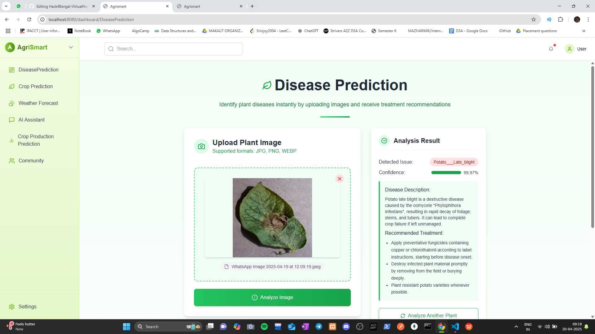
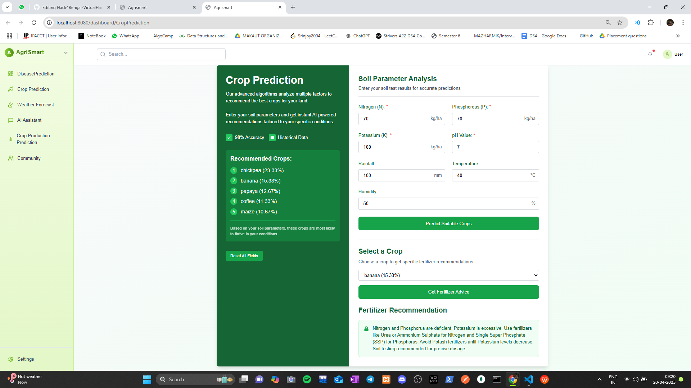
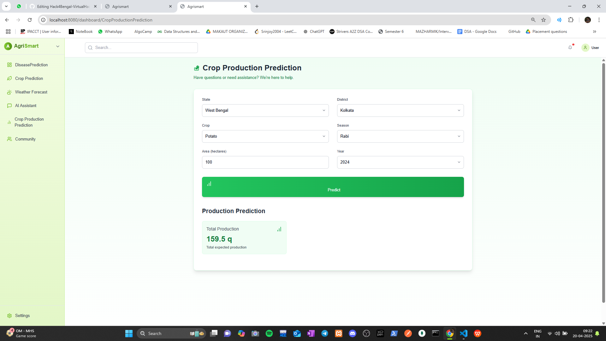

# 🌾 AgriSmart.Ai – Revolutionizing Agriculture with AI

> **Empowering Farmers with AI-Driven Insights for Sustainable Farming**  
> *Developed with passion for the Hack4Bengal Virtual Hacks.*


## 🚀 Overview

**AgriSmart.Ai** is an intelligent agricultural assistant designed to empower farmers and agricultural enthusiasts with data-driven insights. By leveraging AI-powered analytics and real-time data, it enhances agricultural productivity and efficiency.

---

## 🧠 Problem Statement

> 🌱 Farmers often lack access to timely and accurate information regarding crop health, soil conditions, and weather patterns.  
> 🌾 Traditional farming methods may not be sufficient to meet the demands of modern agriculture.  
> 📉 There's a need for a centralized platform that offers data-driven solutions to common agricultural challenges.

---

## ✨ Key Features

| 👨‍🌾 For Farmers | 🧑‍💻 For Researchers |
|-----------------|---------------------|
| 📸 **Crop Disease Detection via Image Analysis** | 📊 **Access to Agricultural Data for Research** |
| 🌦️ **Weather Forecasting for Optimal Farming** | 🧪 **Experimentation with ML Models** |
| 🧪 **Soil Health Monitoring** | 🔍 **Analysis of Crop Patterns** |
| 📈 **Yield Prediction and Recommendations** | 📚 **Contribution to Open-Source Agricultural Tools** |

---

## 📸 Feature Demonstrations

### 🖼️ Crop Disease Detection



*Utilizes a custom-built Convolutional Neural Network (CNN) optimized for low-resource devices to detect crop diseases in real-time.*

### 🖼️ Soil Health Analysis



*Evaluates key soil parameters like pH, NPK levels, and moisture to recommend the most suitable crops tailored to local conditions.*


### 🗣️ Multilingual Chatbot for Farmers

.png)

*Answers farmers’ questions related to farming, including crops, weather, and pests, in multiple regional languages to ensure better accessibility and support.*

---

### 🖼️ Yield Prediction



*Uses time series forecasting models to predict future crop yields, empowering farmers with valuable insights into market trends.*

---

## 👥 Target Users

- 👨‍🌾 **Farmers** seeking to improve crop yield and health.
- 🧑‍🔬 **Agricultural Researchers** analyzing farming data.
- 🏢 **AgriTech Companies** aiming to integrate AI into their solutions.
- 🧑‍💻 **Developers** interested in agricultural AI applications.

---

## 🛠️ Tech Stack

### 🌐 Frontend

- `TypeScript`, `Tailwind CSS`, `JavaScript` `React.js`
- Responsive design for accessibility

### 🔧 Backend

- `Python`
- `Flask` for API development
- `SQLAlchemy` for database interactions

### 🤖 Machine Learning & AI

| Task | Technology |
|------|------------|
| Crop Disease Detection | `TensorFlow`, `Keras`, `OpenCV` |
| Weather Prediction | `Scikit-learn`, `Pandas` |
| Soil Analysis | `NumPy`, `Matplotlib` |
| Yield Prediction | `XGBoost`, `LightGBM` |

---

## 🧪 Datasets Used

| Dataset | Description |
|---------|-------------|
| PlantVillage | Images for crop disease detection |
| FAO Weather Data | Historical weather patterns |
| SoilGrids | Global soil information |
| Kaggle Crop Yield Dataset | Data for yield prediction models |

---

## 📈 Success Metrics

| Metric | Target |
|--------|--------|
| 🎯 Crop Disease Detection Accuracy | ≥ 90% |
| 🌦️ Weather Prediction Accuracy | ≥ 85% |
| 🧪 Soil Health Analysis Precision | ≥ 88% |
| 📈 Yield Prediction Accuracy | ≥ 92% |

---

## 🗃️ System Architecture

```plaintext
User Interface
     ↓
Frontend (HTML/CSS/JS)
     ↓
Backend (Flask API)
     ↓
Machine Learning Models
     ↓
Database (SQLAlchemy)
```

---

## 🌍 Accessibility & Inclusivity

- 🌐 Multilingual support for diverse user base
- 📱 Mobile-friendly design for on-the-go access
- 🧑‍🦯 Screen reader compatibility for visually impaired users

---

## 🔗 Useful Links

- 🧠 **GitHub Repository:** [AgriSmart.Ai](https://github.com/Srinjoy2004/Hack4Bengal-VirtualHacks---AgriSmart.Ai)
- 📄 **Project Documentation:** [AgriSmart.Ai Docs](#) *(Link to be provided)*

---

## 🔮 Future Enhancements

- 📱 Development of a dedicated mobile application
- 🌐 Integration with IoT devices for real-time data collection
- 🧠 Implementation of deep learning models for advanced analytics
- 📊 Dashboard for real-time monitoring and alerts

---

## 🤝 Team

**Team Name:** AgriSmart.Ai  
👨‍💻 **Team Lead:** Srinjoy Pramanik
**Team Members :** Arpan Chowdhury I Syed Md.Musharraf I Subhabilas

🏫 **Hackathon:** Hack4Bengal Virtual Hacks

---

Feel free to customize this `README.md` further to align with your project's specifics. If you have images or diagrams of your machine learning models, you can include them in the respective sections using markdown syntax:

```markdown

```

